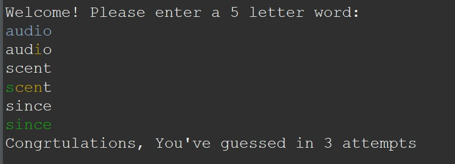
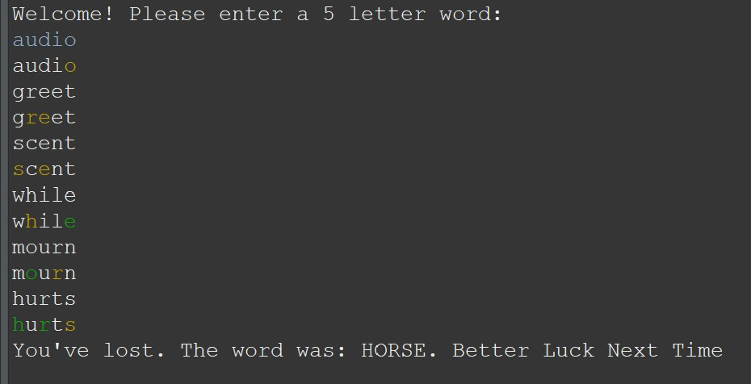
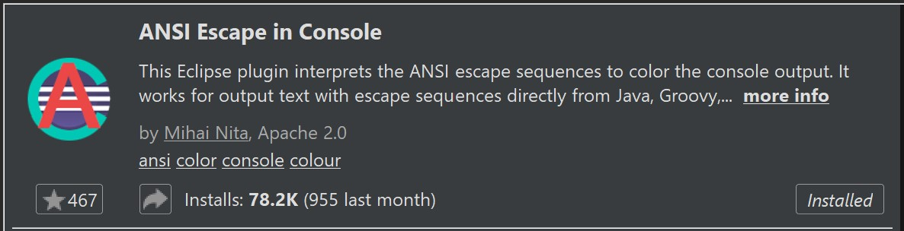
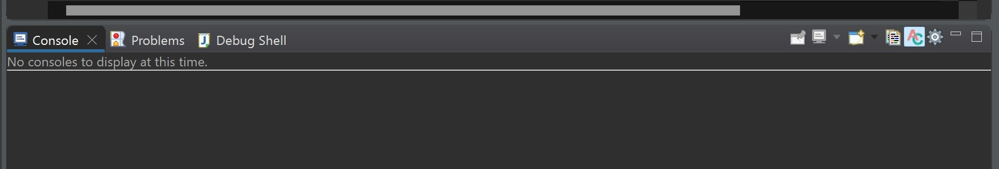

# Java WORDL CLI

## MVP

-   Recreate a simplified version of the game Wordle to be played in a Java console application
-   The game should be able to randomly select a 5-letter word from the provided word list
-   The user will be able to enter a guess word that is also 5 characters long
-   For each letter, the application will tell the user if that letter is correct, right letter in the wrong position, or wrong letter
-   After the user guesses 6 times incorrectly, the game is over and the user loses
-   If the user guesses the word correctly, the game is over and the user wins
-   In addition you must implement one extension
    -   Extension Included: JSON Parser File Reader: Read the word list directly from the file when the application starts

## Screenshots

## How to interact with this game?

You need to guess which is the word of the day. This is a 5 leeters word.
You'll be prompted to type a 5 letters word to begin with, trying to guess. Hit ENTER after typing.
If the letters you type exist in the word of the day, but in a different position, you'll get them back in YELLOW.
If the letters you type exist in the word in the correct position, you'll get them back in GREEN.
If they don't exist in the word, you'll get them back with no color.
You have 6 attempts.
If you guess, you win. If you don't, the word will be revealed to you and better luck next time.

### Eclipse Marketplace Extension Needed

To get the colored output in the console, I installed and used ANSI CONSOLE

## How did I approach this project?

I wrote peudo coude describing what would I need to make this project work.
Once I've done that, I started writing the code.
Once finished, I extracted the methods from the main code to make it more modular.
Finally, I created classes and refactored to a more OOP structure.

## What did I struggle with?

Coming from JavaScript as my first programming language, changing my mindset from Functional/Procedural Programming to an OOP mindset was a bit hard. I actually realised this was a problem when I finished my coding and I saw that all of my code was under the class Main. Refactoring it to a OOP and separating the program into classes was a bit challenging after having the whole program already coded.

## What would I do differently next time?

I would definitely spend some time at first designing and deciding the structure of the prorgam, the classes I would need, the interfaces, etc. So I can start coding with an OOP mindset from the get go.
